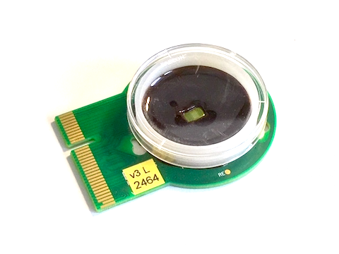

# hana: high density micro electrode array recordings analysis



Hana is a Python library for analysing recordings made by the "hidens" high density micro electrode arrays.

If you use this library in your research, please cite our paper ([Frontiers](???)):

> Bullmann T, Radivojevic M, Huber S, Deligkaris K, Hierlemann A, Frey U (2019) Large-scale mapping of axonal arbors using high-density microelectrode arrays. _Accepted_

```bib
@article {Bullmann2019b,
	author = {Torsten Bullmann, Milos Radivojevic, Stefan Huber, Kosmas Deligkaris, Andreas Reinhold Hierlemann, Urs Frey},
	title = {Large-scale mapping of axonal arbors using high-density microelectrode arrays},
	year = {2019},
	doi = {},
	URL = {},
	eprint = {},
	journal = {Frontiers in Cellular Neuroscience, section Cellular Neurophysiology}
}
```

## Requirements

Hana requires Python 2.7 to run, but might be compatible to Pyhton 3.5.
For a full list of dependencies, see the [`requirements.txt`](requirements.txt) file.
An example conda environment can be found in the [`environment.yaml`](environment.yaml) file

## Installation

See installation instruction for the [hdmea_axons](https://github.com/tbullmann/hdmea_axon) package.

## Usage

1. [hdmea_axon](https://github.com/tbullmann/hdmea_axon).
2. [hdmea_network](https://github.com/tbullmann/hdmea_network).


## Components

### Main functionality
* [Accessing data](recording.py)
* [Segmenation of axons and dendrites](segmentation.py)
* [Estimation of structural connectivity](structure.py)
* [Estimation of functional connectivity](function.py) and some [tests](test_function.py)
* [Detection of polychronous groups](polychronous.py)

### Supporting
* [Miscellaneous](misc.py)
* [General plotting functions](plotting.py)
* [Hexagonal grid conversions](grid.py)
* [HDF5 for dictionaries](h5dict.py)

## Acknowledgement

The h4dict code was posted by a unknown user [hjpaul](http://codereview.stackexchange.com/users/27783/hpaulj) on stackexchange, and the original can be found [here](http://codereview.stackexchange.com/questions/120802/recursively-save-python-dictionaries-to-hdf5-files-using-h5py)
